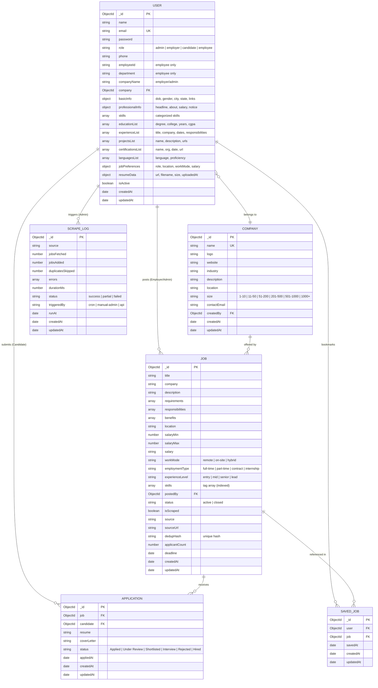

# JobNest Database Schema Specification

## 1. Database Architecture Overview

The JobNest application uses **MongoDB** as its primary NoSQL document database, modeled using **Mongoose ODM** with strict schemas, timestamps, indexes, validation, and pre-save password hashing.

- **Engine**: MongoDB 7.0+ (with fallback embedded `mongodb-memory-server` for zero-friction local development)
- **ODM**: Mongoose v8.9.5
- **Design Pattern**: Document references (`ObjectId`) for relational integrity between Users, Jobs, Applications, Companies, Saved Jobs, and Scrape Logs.

---

## 2. Entity-Relationship Diagram (ERD)

---

## 3. Detailed Collection Schemas

### 3.1 `users` Collection

Stores authentication and user profiles across all 4 system roles (`candidate`, `employer`, `admin`, `employee`).

| Field Name | Type | Constraints | Default | Description |
|---|---|---|---|---|
| `_id` | `ObjectId` | Primary Key | Auto | Unique User identifier |
| `name` | `String` | Required, Trim | - | Full Name |
| `email` | `String` | Required, Unique, Lowercase, Regex | - | Login email address |
| `password` | `String` | Required, Min 6 chars, `select: false` | - | Salted bcrypt hash |
| `role` | `String` | Required, Enum `['admin', 'employer', 'candidate', 'employee']` | `'candidate'` | RBAC system role |
| `phone` | `String` | Trim | `''` | Contact phone number |
| `employeeId` | `String` | Trim | `''` | Corporate Employee ID (Employee role) |
| `department` | `String` | Trim | `''` | Department name (Employee role) |
| `companyName` | `String` | Trim | `''` | Employer company name |
| `companyLocation`| `String`| Trim | `''` | Employer headquarters/office |
| `company` | `ObjectId` | Ref: `Company` | `null` | Associated company document |
| `basicInfo` | `Object` | Embedded document | `{}` | Date of birth, gender, city, state, LinkedIn, GitHub, portfolio URLs |
| `professionalInfo`| `Object`| Embedded document | `{}` | Headline, about me, total experience, current job, expected salary, notice period |
| `skills` | `[String]` | Array of Strings | `[]` | Flat skill tags list |
| `categorizedSkills`| `Object`| Technical, Languages, Frameworks, Databases, Tools | `{}` | Categorized skill chips |
| `educationList` | `[Object]` | Array of objects | `[]` | Degree, specialization, college, start/end years, CGPA |
| `experienceList`| `[Object]` | Array of objects | `[]` | Job title, company, location, start/end dates, responsibilities, tech tags |
| `projectsList` | `[Object]` | Array of objects | `[]` | Name, description, tech stack, project URL, GitHub repository URL |
| `certificationsList`|`[Object]`| Array of objects | `[]` | Name, issuing organization, issue date, certificate credential URL |
| `languagesList` | `[Object]` | Array of objects | `[]` | Language name and proficiency (`Basic`, `Intermediate`, `Fluent`, `Native`) |
| `jobPreferences`| `Object` | Embedded document | `{}` | Preferred role, locations array, workMode, employmentType, expectedSalary |
| `resume` | `String` | URL path | `''` | Relative path to uploaded PDF/DOC resume |
| `resumeData` | `Object` | Embedded document | `{}` | Uploaded file metadata: filename, url, size in bytes, timestamp |
| `profilePhoto` | `String` | URL path | `''` | Relative path to uploaded avatar |
| `isActive` | `Boolean` | Flag | `true` | Account active/disabled status |
| `createdAt` | `Date` | Timestamp | Auto | Document creation date |
| `updatedAt` | `Date` | Timestamp | Auto | Last update date |

---

### 3.2 `jobs` Collection

Stores job postings created by employers or ingested via the scraper engine.

| Field Name | Type | Constraints | Default | Description |
|---|---|---|---|---|
| `_id` | `ObjectId` | Primary Key | Auto | Unique Job ID |
| `title` | `String` | Required, Trim | - | Job Title (e.g. "Senior React Developer") |
| `company` | `String` | Required, Trim | - | Company name |
| `companyName` | `String` | Trim | - | Normalized company name |
| `description` | `String` | Required | - | Full markdown / HTML job description |
| `requirements` | `[String]` | Array of Strings | `[]` | Bulleted list of candidate requirements |
| `responsibilities`| `[String]`| Array of Strings | `[]` | Key day-to-day duties |
| `benefits` | `[String]` | Array of Strings | `[]` | Perks (Health, 401k, Remote stipends) |
| `location` | `String` | Required, Trim | - | City, State or "Remote" |
| `salary` | `String` | Trim | `'Negotiable'` | Human-readable salary string |
| `salaryMin` | `Number` | Positive integer | `0` | Minimum annual salary (USD / INR) |
| `salaryMax` | `Number` | Positive integer | `0` | Maximum annual salary |
| `workMode` | `String` | Trim | `'On-site'` | `'Remote'`, `'Hybrid'`, or `'On-site'` |
| `employmentType`| `String` | Trim | `'Full-time'`| `'Full-time'`, `'Part-time'`, `'Contract'`, `'Internship'` |
| `experienceLevel`| `String` | Trim | `'mid'` | `'entry'`, `'mid'`, `'senior'`, `'lead'` |
| `skills` | `[String]` | Array of Strings | `[]` | Required technical skills |
| `deadline` | `Date` | Date | `null` | Application deadline |
| `postedBy` | `ObjectId` | Ref: `User` | `null` | User ID of employer who created posting |
| `status` | `String` | Enum `['active', 'closed']` | `'active'` | Job visibility status |
| `isScraped` | `Boolean` | Flag | `false` | Ingested via web scraper engine |
| `source` | `String` | Trim | `'Direct'` | Post source (e.g. "Direct", "Arbeitnow", "GitHub") |
| `sourceUrl` | `String` | Trim | `''` | Original URL of external job |
| `dedupHash` | `String` | Hex String | `null` | SHA256 deduplication fingerprint |
| `applicantCount`| `Number` | Integer | `0` | Cached count of candidate applications |
| `createdAt` | `Date` | Timestamp | Auto | Creation date |
| `updatedAt` | `Date` | Timestamp | Auto | Last updated date |

---

### 3.3 `applications` Collection

Connects Candidates to Jobs they have applied for, with status workflow management.

| Field Name | Type | Constraints | Default | Description |
|---|---|---|---|---|
| `_id` | `ObjectId` | Primary Key | Auto | Application record ID |
| `job` | `ObjectId` | Required, Ref: `Job` | - | Referenced Job document |
| `candidate` | `ObjectId` | Required, Ref: `User` | - | Applying candidate user ID |
| `resume` | `String` | URL path | `''` | Resume snapshot URL at time of application |
| `coverLetter` | `String` | Text | `''` | Candidate cover letter / personal statement |
| `status` | `String` | Enum | `'Applied'` | Workflow: `Applied`, `Under Review`, `Shortlisted`, `Interview`, `Rejected`, `Hired` |
| `appliedAt` | `Date` | Timestamp | `Date.now` | Submission timestamp |
| `createdAt` | `Date` | Timestamp | Auto | Record creation timestamp |
| `updatedAt` | `Date` | Timestamp | Auto | Last status modification |

---

### 3.4 `companies` Collection

Stores company profiles and brand identities.

| Field Name | Type | Constraints | Default | Description |
|---|---|---|---|---|
| `_id` | `ObjectId` | Primary Key | Auto | Company identifier |
| `name` | `String` | Required, Unique, Trim | - | Registered company name |
| `logo` | `String` | Image URL | `''` | Company logo image path |
| `website` | `String` | URL, Trim | `''` | Official website URL |
| `industry` | `String` | Trim | `'Technology'` | Primary business industry |
| `description` | `String` | Text | `''` | About company / mission |
| `location` | `String` | Trim | `''` | Headquarters location |
| `size` | `String` | Enum | `'51-200'` | `1-10`, `11-50`, `51-200`, `201-500`, `501-1000`, `1000+` |
| `contactEmail` | `String` | Email | `''` | HR / Careers contact email |
| `createdBy` | `ObjectId` | Ref: `User` | `null` | Employer account that registered company |
| `createdAt` | `Date` | Timestamp | Auto | Creation date |
| `updatedAt` | `Date` | Timestamp | Auto | Last update date |

---

### 3.5 `savedjobs` Collection

Handles job bookmarking for candidates.

| Field Name | Type | Constraints | Default | Description |
|---|---|---|---|---|
| `_id` | `ObjectId` | Primary Key | Auto | Saved record ID |
| `user` | `ObjectId` | Required, Ref: `User` | - | Bookmark owner |
| `job` | `ObjectId` | Required, Ref: `Job` | - | Bookmarked job |
| `savedAt` | `Date` | Timestamp | `Date.now` | Bookmark timestamp |

---

### 3.6 `scrapelogs` Collection

Tracks audit logs of automated background job aggregation and manual runs.

| Field Name | Type | Constraints | Default | Description |
|---|---|---|---|---|
| `_id` | `ObjectId` | Primary Key | Auto | Log record ID |
| `source` | `String` | Required | `'Public Aggregator'` | Source target name |
| `jobsFetched` | `Number` | Integer | `0` | Total raw jobs fetched from external provider |
| `jobsAdded` | `Number` | Integer | `0` | New distinct jobs inserted |
| `duplicatesSkipped`| `Number`| Integer | `0` | Duplicate jobs filtered by hash |
| `errors` | `[String]` | Array | `[]` | Error messages encountered |
| `durationMs` | `Number` | Milliseconds | `0` | Total execution duration |
| `status` | `String` | Enum `['success', 'partial', 'failed']` | `'success'` | Overall run status |
| `triggeredBy` | `String` | Enum `['cron', 'manual-admin', 'api']` | `'cron'` | Ingestion trigger source |
| `runAt` | `Date` | Timestamp | `Date.now` | Execution start timestamp |

---

## 4. Database Indexes & Query Optimization

| Collection | Indexed Fields | Type | Purpose |
|---|---|---|---|
| `users` | `{ email: 1 }` | Unique B-Tree | Ensures zero email collisions & O(1) login lookup |
| `jobs` | `{ title: 'text', company: 'text', description: 'text', skills: 'text' }` | Compound Text Index | Full-text keyword search across job postings |
| `jobs` | `{ dedupHash: 1 }` | Sparse Index | Fast deduplication check during scraping |
| `jobs` | `{ postedBy: 1, createdAt: -1 }` | Compound Index | Rapid retrieval of employer job management list |
| `applications` | `{ job: 1, candidate: 1 }` | Compound Unique Index | Prevents duplicate applications by same candidate |
| `applications` | `{ candidate: 1, appliedAt: -1 }` | Compound Index | Fast "My Applications" candidate dashboard queries |
| `applications` | `{ job: 1, status: 1 }` | Compound Index | Fast employer applicant screening and filtering |
| `savedjobs` | `{ user: 1, job: 1 }` | Compound Unique Index | Prevents duplicate job bookmarks |
| `savedjobs` | `{ user: 1, savedAt: -1 }` | Compound Index | Paginated candidate saved jobs feed |
| `scrapelogs` | `{ runAt: -1 }` | Descending B-Tree | Admin audit timeline ordering |

---

## 5. Security, Validation & Integrity Rules

1. **Password Hashing**: Mongoose pre-save hook executes `bcryptjs.genSalt(10)` and `bcryptjs.hash()` whenever the password field is modified. Passwords are never returned in queries (`select: false`).
2. **Referential Integrity**: All deletions of jobs cascade to remove or flag associated applications and saved job entries.
3. **Duplicate Prevention**: Compound unique indexes at the database engine level ensure that even under high concurrency or network retries, candidates cannot submit duplicate applications or create duplicate bookmarks.
4. **Data Normalization**: Emails and URLs are trimmed, lowercased, and sanitized prior to database persistence.
